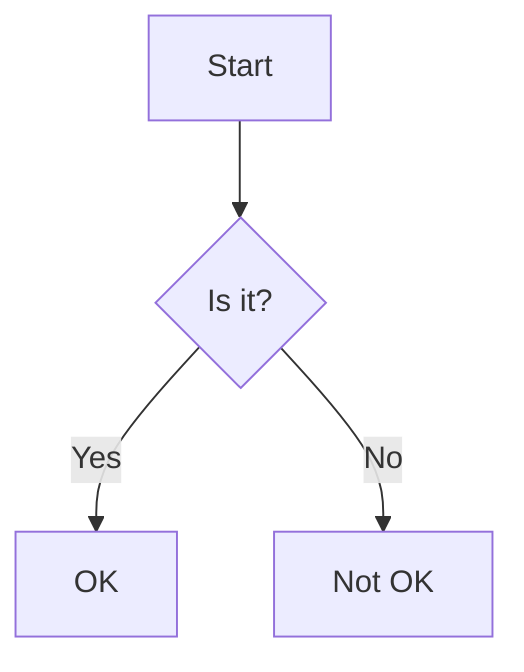

# ned

A CLI note-taking application.

## Installation

```bash
go install github.com/julianshen/ned@latest
```

## Usage

```
ned <command> [options]
```

## Commands

- `new` or `n`: Create a new note.
- `edit` or `e`: Edit an existing note.
- `list` or `l`: List all notes.
- `delete` or `d`: Delete a note.
- `view` or `v`: View a note in the browser.
- `help` or `h`: Show help for a command.
- `config`: Manage configuration
  - `config set [key] [value]`: Set a configuration value
  - `config show`: Show all configuration values

All notes are stored in `$HOME/.mynotes` directory.

## Configuration

Configuration is stored in `$HOME/.config/ned/config.toml` in TOML format. Available configuration options:

- `ANTHROPIC_API_KEY`: API key for Claude.ai integration

## Features

- Markdown notes with `.md` extension (using [goldmark](https://github.com/yuin/goldmark) parser)
- Tree-style note listing
- Browser-based note viewing
- Mermaid diagram support in markdown files
- Image support in notes
  - Images are stored in `._images_` directories alongside notes
  - Support both relative paths (e.g., ``) and folder paths (e.g., ``)
  - Images in notes inherit their note's folder structure (e.g., for a note in `folder1/note.md`, an image `` is stored in `folder1/._images_/image.png`)

Example of a Mermaid diagram:

