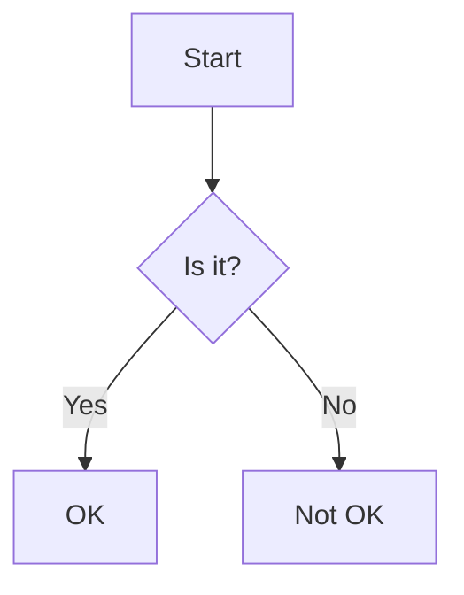

# ned

A CLI note-taking application.

## Installation

```bash
go install github.com/julianshen/ned@latest
```

## Usage

```
ned <command> [options]
```

## Commands

- `new` or `n`: Create a new note.
- `edit` or `e`: Edit an existing note.
- `list` or `l`: List all notes.
- `delete` or `d`: Delete a note.
- `view` or `v`: View a note in the browser.
- `help` or `h`: Show help for a command.

All notes are stored in `$HOME/.mynotes` directory.

## Features

- Markdown notes with `.md` extension
- Tree-style note listing
- Browser-based note viewing
- Mermaid diagram support in markdown files

Example of a Mermaid diagram:

